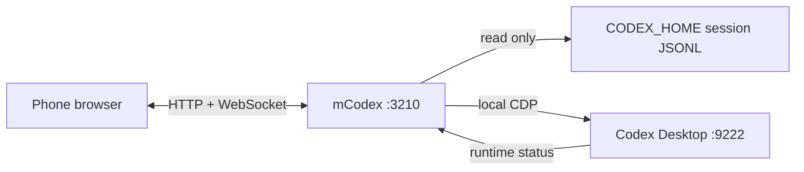

# mCodex

### Use Codex Desktop on Windows from a phone browser

English | [中文](README_ZH.md) | [Changelog](CHANGELOG.md)

mCodex runs on the same Windows PC as Codex Desktop. It reads saved sessions from `CODEX_HOME` and uses the local CDP connection for desktop actions. Session files are read-only.

This is an unofficial project and is not affiliated with OpenAI.

## Why mCodex?

Codex Desktop normally requires you to stay at the PC where it is running. mCodex adds a browser interface for the same local tasks, so you can check progress or send a follow-up from a phone on the same network.

- No separate account system
- No cloud service or conversation upload
- Desktop actions are still performed by Codex Desktop
- Localhost by default; LAN access requires pairing and token authentication

## Features

- View projects, task history, and live output
- Open a task and send messages or follow-ups
- Stop a running task and handle approval requests
- View and change the Codex Desktop permission mode
- Send up to four images and view images from previous messages
- View file changes, paths, and added or removed line counts
- Create projects and tasks from the browser
- Connect a phone with a short-lived pairing code

## How it works



mCodex reads the session timeline from JSONL files and gets the current runtime state through CDP. Sending messages, stopping tasks, handling approvals, and creating tasks are delegated to Codex Desktop.

## Quick start

### Requirements

- Windows 10 or 11
- The Microsoft Store version of Codex Desktop, installed and signed in
- Node.js `20.19+` or `22.12+` when running from source
- A modern browser with WebSocket support

Close Codex Desktop before the first start. mCodex restarts it with a local CDP port. If Codex Desktop is already running without CDP, control actions will not be available.

### Run with the management script

Double-click `manage.bat`, or run:

```bat
manage.bat start
```

The script checks Node.js and Codex Desktop, installs npm dependencies, builds the project, starts Codex Desktop with CDP enabled, and opens `http://127.0.0.1:3210/`.

Scan the QR code from a phone connected to the same Wi-Fi network. The pairing code expires after 10 minutes.

## Download and installation

mCodex has three Windows release formats:

| Package | Usage |
| --- | --- |
| `mCodex-*-source.zip` | Source code; Node.js and `npm ci` are required |
| `mCodex-*-win-x64-portable.zip` | Includes Node.js; extract and run `start.bat` |
| `mCodex-*-win-x64.exe` | Single-file Node SEA executable |

The EXE is currently unsigned, so Windows SmartScreen may show an unknown publisher warning.

To build the packages locally:

```powershell
npm run release:source
npm run release:portable
npm run release:sea
npm run release
```

## Manual setup

```powershell
npm ci
npm run build

powershell -ExecutionPolicy Bypass -File .\scripts\start-codex-cdp.ps1
npm start
```

Manual startup listens on `127.0.0.1:3210` by default. To enable LAN access, set a token with at least 24 characters:

```powershell
$env:BRIDGE_HOST = '0.0.0.0'
$env:BRIDGE_TOKEN = 'replace-with-a-random-token-at-least-24-characters-long'
npm start
```

## Commands

| Command | Description |
| --- | --- |
| `manage.bat start` | Build and start Codex Desktop and mCodex for LAN access |
| `manage.bat restart` | Restart mCodex |
| `manage.bat stop` | Stop mCodex without closing Codex Desktop |
| `manage.bat status` | Check ports `3210` and `9222` |
| `manage.bat install` | Install npm dependencies |
| `manage.bat build` | Build the server and web client |
| `manage.bat cdp` | Start only Codex Desktop with CDP enabled |
| `manage.bat lan` | Start mCodex on `0.0.0.0:3210` |
| `manage.bat logs` | Show recent logs |
| `manage.bat open` | Open the local web page |

## LAN access

`manage.bat start` listens on `0.0.0.0:3210`. Connect the phone and PC to the same network, then use the QR code shown on the local page or open:

```text
http://<PC LAN IP>:3210/
```

If Windows Firewall prompts for access, allow port `3210` only on private networks. Do not forward port `9222`.

## Configuration

`.env.example` lists the available variables, but mCodex does not load `.env` automatically.

| Variable | Default | Description |
| --- | --- | --- |
| `BRIDGE_HOST` | `127.0.0.1` | Listen address; non-loopback addresses require authentication |
| `BRIDGE_PORT` | `3210` | HTTP and WebSocket port |
| `BRIDGE_TOKEN` | empty | Token used for LAN access; must contain at least 24 characters |
| `BRIDGE_TOKEN_FILE` | `CODEX_HOME/remote-bridge-token` | File used to persist the generated device token |
| `CODEX_HOME` | `%USERPROFILE%\.codex` | Codex session directory |
| `CODEX_CDP_URL` | `http://localhost:9222` | Local Codex Desktop CDP endpoint |
| `BRIDGE_SCAN_INTERVAL_MS` | `500` | Session scan interval in milliseconds |

Delete `CODEX_HOME/remote-bridge-token` to revoke all paired devices.

## Development

```powershell
npm ci
npm run dev
npm test -- --run
npm run build
```

`npm run dev` starts Vite on `127.0.0.1:5173` and proxies API and WebSocket requests to port `3210`. Start Codex Desktop separately with `manage.bat cdp` when testing control actions.

## API overview

All `/api/*` routes require a token except `/api/health`, `/api/pair`, and the localhost-only `/api/pairing-info`. API requests use `Authorization: Bearer <token>`. `/api/media` and `/ws` use a query token.

| Method | Path | Description |
| --- | --- | --- |
| `GET` | `/api/health` | Health and authentication status |
| `GET` | `/api/status` | Bridge, CDP, and session status |
| `PUT` | `/api/permissions` | Change the Codex Desktop permission mode |
| `GET` | `/api/threads` | List tasks |
| `GET` | `/api/threads/:id/timeline` | Read a task timeline and approval requests |
| `GET` | `/api/media` | Read an image referenced by a task |
| `POST` | `/api/threads/:id/open` | Open a task in Codex Desktop |
| `POST` | `/api/threads/:id/send` | Send a message |
| `POST` | `/api/threads/:id/follow-up` | Queue, steer, or interrupt with a follow-up |
| `POST` | `/api/threads/:id/stop` | Stop a running task |
| `POST` | `/api/threads/:id/approval` | Approve or reject a request |
| `GET` / `POST` | `/api/projects` | List or create projects |
| `GET` | `/api/fs/roots` | List common directories and drive roots |
| `GET` | `/api/fs/list` | List subdirectories |
| `POST` | `/api/tasks` | Create a task |

### Project structure

```text
src/
  server.ts                 HTTP API, authentication, and WebSocket
  cdp/controller.ts         Codex Desktop control
  sessions/store.ts         Session lookup and reading
  sessions/watcher.ts       Session change polling
  sessions/parser.ts        Timeline parsing
  runtime-status.ts         Desktop runtime status merge
web/src/
  main.tsx                  React interface
  styles.css                Mobile-first styles
scripts/                    Build and Windows management scripts
manage.bat                  Windows command entry point
```

## Security

- Do not expose port `9222` to the LAN or Internet.
- Use mCodex only on a trusted network.
- LAN access requires token authentication.
- mCodex has no multi-user isolation or audit system.
- Session files may contain source code, credentials, and private conversations.
- mCodex does not include telemetry or upload conversation data.

Read [SECURITY.md](SECURITY.md) before enabling LAN access.

## Known limitations

- Only Windows 10/11 and the Microsoft Store version of Codex Desktop are supported.
- A Codex Desktop update may change CDP controls and break control actions.
- When the PC sleeps or Codex Desktop exits, only the last saved session state remains available.
- mCodex does not provide public Internet access, user accounts, or multi-user isolation.
- The Windows EXE is not code-signed.

## Troubleshooting

| Problem | What to check |
| --- | --- |
| `Node.js not found` | Install Node.js `20.19+` or `22.12+`, then reopen the terminal |
| `Codex control: OFFLINE` | Exit Codex Desktop, run `manage.bat cdp`, then check `manage.bat status` |
| Phone cannot open the page | Check that both devices are on the same network and allow port `3210` on private networks |
| Pairing code expired | Restart mCodex to create another code |
| Tasks are visible but cannot be controlled | Check whether the local CDP connection is online |
| Startup failed | Run `manage.bat logs` and check `.run-logs\bridge.err.log` |

## Contributing

Issues and pull requests are welcome. Changes to CDP selectors, authentication, session parsing, or remote access should include tests or reproduction steps.

Before submitting a pull request:

```powershell
npm test -- --run
npm run build
```

See [CONTRIBUTING.md](CONTRIBUTING.md) for details.

## License

[MIT](LICENSE)
