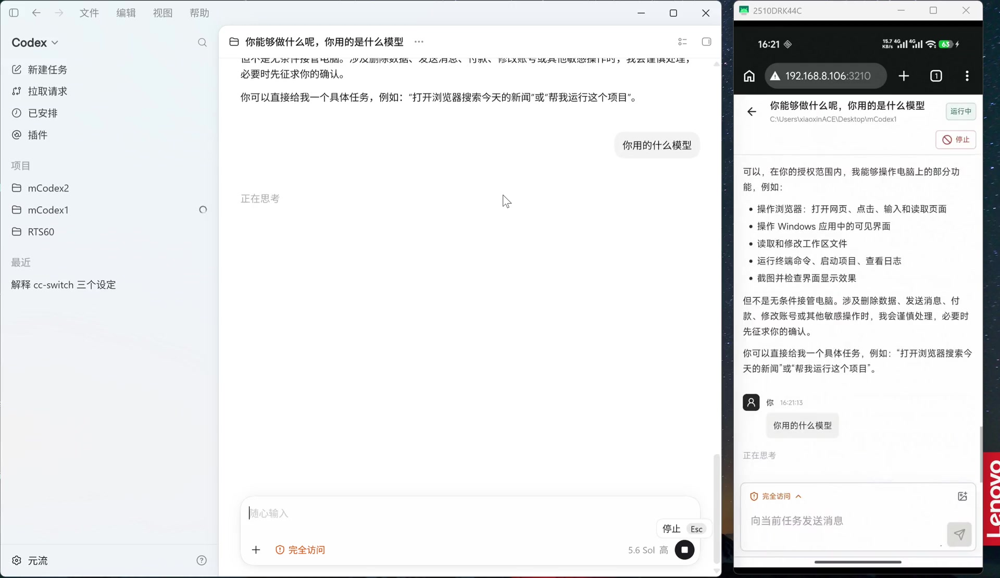
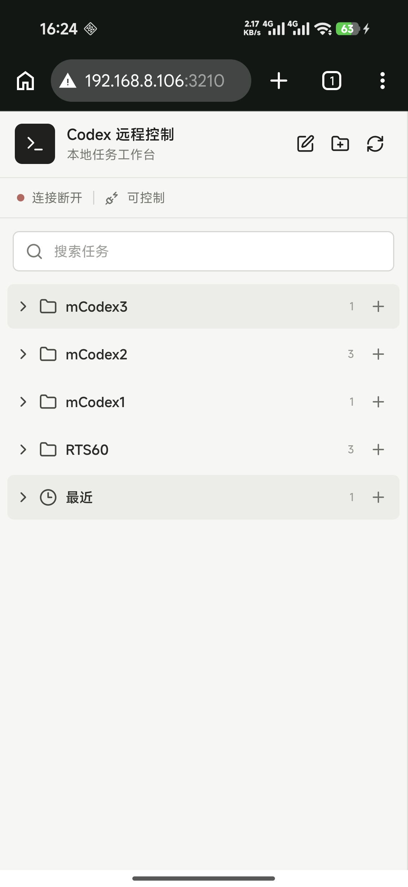
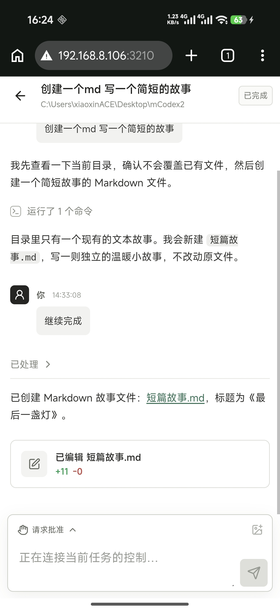
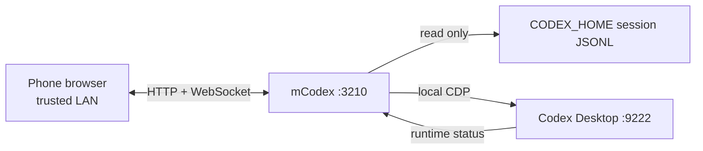
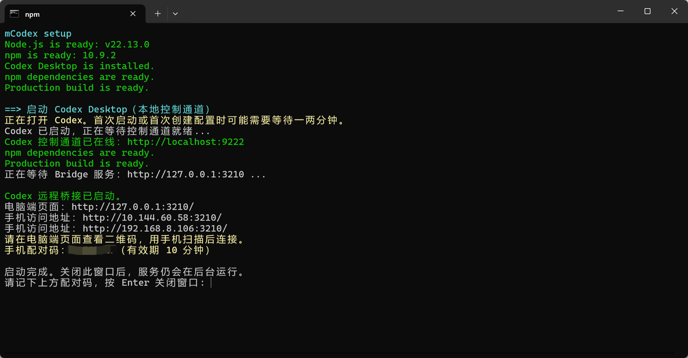

<div align="center">

# mCodex

**A Windows-first mobile companion for Codex Desktop**

Built specifically for Windows 10/11: check tasks, send follow-ups, handle
approvals, and start new work from your phone while Codex Desktop stays on the PC.

[English](README.md) · [中文](README_ZH.md) · [Changelog](CHANGELOG.md) · [Contributing](CONTRIBUTING.md)

[](#requirements)
[](#requirements)
[](LICENSE)

</div>

> [!IMPORTANT]
> **Windows is the project's primary and only currently supported desktop platform.** mCodex targets Windows 10/11 and the Microsoft Store build of Codex Desktop. macOS and Linux hosts are not currently supported; the client can be any modern phone or desktop browser.

> [!NOTE]
> mCodex is an unofficial community project and is not affiliated with OpenAI. It still requires an installed and signed-in Codex Desktop app.

mCodex runs alongside Codex Desktop on the same Windows PC. It reads the local task history from `CODEX_HOME` without modifying session files, and delegates interactive actions to Codex Desktop through a local CDP connection. mCodex adds no cloud relay and does not upload your conversations.

<p align="center">
  <a href="readme/demo.mp4?raw=1">
    
  </a>
</p>

<p align="center"><strong><a href="readme/demo.mp4?raw=1">Watch the 1:43 demo</a></strong></p>

## Why mCodex?

Codex Desktop is designed around the PC. Existing ways to reach an AI assistant from a phone either change the account/request path, leave the Desktop task context behind, stream an entire desktop, or require a much heavier deployment than a personal LAN tool needs.

| Common approach | Practical pain point | How mCodex differs |
| --- | --- | --- |
| **Unofficial accounts, wrappers, or relay services** | Some services ask for cookies or tokens, or send requests through third-party relays. This expands credential exposure, while an unusual session/request path may increase the risk of extra verification, feature restrictions, or account suspension. | mCodex does not provide unofficial accounts, take over authentication, or proxy model requests. It reuses the official OAuth session already held by Codex Desktop. |
| **The official ChatGPT mobile app** | It requires a separate official-account sign-in on the phone, yet remains a general ChatGPT client rather than a view into the same Codex Desktop projects, local workspace, running tasks, approvals, and file changes. Internet conditions may also make interaction feel slow or unstable. | The phone browser does not ask for your OpenAI credentials again. It talks to mCodex over the LAN and keeps the Desktop task context; model requests still go through Codex Desktop and OpenAI's official service. |
| **Remote desktop tools such as ToDesk or Sunlogin** | They stream desktop pixels rather than task semantics. Different resolutions, tiny controls, keyboard input, scrolling, and precise clicking make phone operation cumbersome. | mCodex provides a responsive, touch-oriented interface for the actions a Codex task actually needs. |
| **CLI-only or infrastructure-heavy open-source tools** | Terminal-first workflows are awkward on a phone, while multi-service stacks can be excessive for controlling one personal Windows PC. | mCodex stays focused: one Windows entry script, a local Node.js bridge, a browser UI, and no required database or container platform. |

> [!TIP]
> mCodex improves **access and control**, not the underlying model-service connection. OpenAI requests, account status, quotas, and service availability remain the responsibility of Codex Desktop and the official service.

## What you can do

- Follow live Codex output and browse tasks by project from a phone
- Send messages and follow-ups, attach images, or stop a running task
- Review approval requests and switch the Codex Desktop permission mode
- Inspect changed files and added or removed line counts
- Create projects and start new tasks without returning to the PC
- Pair over a trusted LAN with a short-lived code and persistent device token

## Designed for local use

| | mCodex |
| --- | --- |
| Data | Reads task history directly from the local `CODEX_HOME` directory |
| Control | Delegates actions to your signed-in Codex Desktop app |
| Network | Uses localhost by default; LAN access requires pairing and token authentication |
| Accounts | Adds no separate account system or hosted backend |

## Screenshots

<p align="center">
  
  &nbsp;&nbsp;
  
</p>

<p align="center"><sub>Browse projects and follow a task, including tool activity, file changes, approvals, and follow-up messages.</sub></p>

## How it works



mCodex reads the session timeline from JSONL files and gets the current runtime state through CDP. Sending messages, stopping tasks, handling approvals, and creating tasks are delegated to Codex Desktop.

## Quick start

### Requirements

- Windows 10 or 11
- The Microsoft Store version of Codex Desktop, installed and signed in
- Node.js `20.19+` or `22.12+` when running from source
- A modern browser with WebSocket support

Close Codex Desktop before the first start. mCodex will reopen it with a local CDP port; an already-running Desktop instance without CDP cannot accept control actions.

### Three steps

1. Download or clone this repository.
2. Double-click `manage.bat`, or run:

```bat
manage.bat start
```

3. Open the local page and scan its QR code with a phone on the same Wi-Fi network.

The script checks Node.js and Codex Desktop, installs dependencies, builds mCodex, starts Codex Desktop with CDP enabled, and opens `http://127.0.0.1:3210/`. Pairing codes expire after 10 minutes.

### Successful startup



## Download and installation

mCodex has three Windows release formats:

| Package | Usage |
| --- | --- |
| `mCodex-*-source.zip` | Source code; Node.js and `npm ci` are required |
| `mCodex-*-win-x64-portable.zip` | Includes Node.js; extract and run `start.bat` |
| `mCodex-*-win-x64.exe` | Single-file Node SEA executable |

The EXE is currently unsigned, so Windows SmartScreen may show an unknown publisher warning.

To build the packages locally:

```powershell
npm run release:source
npm run release:portable
npm run release:sea
npm run release
```

## Manual setup

```powershell
npm ci
npm run build

powershell -ExecutionPolicy Bypass -File .\scripts\start-codex-cdp.ps1
npm start
```

Manual startup listens on `127.0.0.1:3210` by default. To enable LAN access, set a token with at least 24 characters:

```powershell
$env:BRIDGE_HOST = '0.0.0.0'
$env:BRIDGE_TOKEN = 'replace-with-a-random-token-at-least-24-characters-long'
npm start
```

## Commands

| Command | Description |
| --- | --- |
| `manage.bat start` | Build and start Codex Desktop and mCodex for LAN access |
| `manage.bat restart` | Restart mCodex |
| `manage.bat stop` | Stop mCodex without closing Codex Desktop |
| `manage.bat status` | Check ports `3210` and `9222` |
| `manage.bat install` | Install npm dependencies |
| `manage.bat build` | Build the server and web client |
| `manage.bat cdp` | Start only Codex Desktop with CDP enabled |
| `manage.bat lan` | Start mCodex on `0.0.0.0:3210` |
| `manage.bat logs` | Show recent logs |
| `manage.bat open` | Open the local web page |

## LAN access

`manage.bat start` listens on `0.0.0.0:3210`. Connect the phone and PC to the same network, then use the QR code shown on the local page or open:

```text
http://<PC LAN IP>:3210/
```

If Windows Firewall prompts for access, allow port `3210` only on private networks. Do not forward port `9222`.

## About remote access

mCodex is designed and supported as a **trusted-LAN application**. It does not provide Internet tunneling, a public gateway, or a hosted relay.

If remote access is required, a third-party tool such as Tailscale or PeanutHull can make the PC's LAN service reachable from another network. The principle is simply to place the phone and PC on the same private virtual network, or tunnel the mCodex service port through an external provider. Tailscale-style private networking is generally preferable to publishing a port directly to the Internet because it avoids a publicly reachable endpoint.

> [!WARNING]
> Third-party networking and tunneling are outside the scope of mCodex. Their configuration, availability, privacy, account, traffic, and security risks are controlled by their respective providers and the user. **The mCodex project and its maintainers assume no responsibility for exposure, data loss, account impact, intrusion, or other consequences caused by such solutions, to the extent permitted by applicable law.** Never expose or forward the Codex CDP port `9222`.

## Configuration

`.env.example` lists the available variables, but mCodex does not load `.env` automatically.

| Variable | Default | Description |
| --- | --- | --- |
| `BRIDGE_HOST` | `127.0.0.1` | Listen address; non-loopback addresses require authentication |
| `BRIDGE_PORT` | `3210` | HTTP and WebSocket port |
| `BRIDGE_TOKEN` | empty | Token used for LAN access; must contain at least 24 characters |
| `BRIDGE_TOKEN_FILE` | `CODEX_HOME/remote-bridge-token` | File used to persist the generated device token |
| `CODEX_HOME` | `%USERPROFILE%\.codex` | Codex session directory |
| `CODEX_CDP_URL` | `http://localhost:9222` | Local Codex Desktop CDP endpoint |
| `BRIDGE_SCAN_INTERVAL_MS` | `500` | Session scan interval in milliseconds |
| `MCODEX_LOCALE` | Auto-detected | Language for the launcher and SEA executable; set `zh-CN` or `en-US` to override Windows UI language |

Delete `CODEX_HOME/remote-bridge-token` to revoke all paired devices.

## Development

```powershell
npm ci
npm run dev
npm test -- --run
npm run build
```

`npm run dev` starts Vite on `127.0.0.1:5173` and proxies API and WebSocket requests to port `3210`. Start Codex Desktop separately with `manage.bat cdp` when testing control actions.

## API overview

All `/api/*` routes require a token except `/api/health`, `/api/pair`, and the localhost-only `/api/pairing-info`. API requests use `Authorization: Bearer <token>`. `/api/media` and `/ws` use a query token.

| Method | Path | Description |
| --- | --- | --- |
| `GET` | `/api/health` | Health and authentication status |
| `GET` | `/api/status` | Bridge, CDP, and session status |
| `PUT` | `/api/permissions` | Change the Codex Desktop permission mode |
| `GET` | `/api/threads` | List tasks |
| `GET` | `/api/threads/:id/timeline` | Read a task timeline and approval requests |
| `GET` | `/api/media` | Read an image referenced by a task |
| `POST` | `/api/threads/:id/open` | Open a task in Codex Desktop |
| `POST` | `/api/threads/:id/send` | Send a message |
| `POST` | `/api/threads/:id/follow-up` | Queue, steer, or interrupt with a follow-up |
| `POST` | `/api/threads/:id/stop` | Stop a running task |
| `POST` | `/api/threads/:id/approval` | Approve or reject a request |
| `GET` / `POST` | `/api/projects` | List or create projects |
| `GET` | `/api/fs/roots` | List common directories and drive roots |
| `GET` | `/api/fs/list` | List subdirectories |
| `POST` | `/api/tasks` | Create a task |

### Project structure

```text
src/
  server.ts                 HTTP API, authentication, and WebSocket
  cdp/controller.ts         Codex Desktop control
  sessions/store.ts         Session lookup and reading
  sessions/watcher.ts       Session change polling
  sessions/parser.ts        Timeline parsing
  runtime-status.ts         Desktop runtime status merge
web/src/
  main.tsx                  React interface
  styles.css                Mobile-first styles
scripts/                    Build and Windows management scripts
manage.bat                  Windows command entry point
```

## Security

- Do not expose port `9222` to the LAN or Internet.
- Use mCodex only on a trusted LAN.
- LAN access requires token authentication.
- Internet tunneling and third-party networking are outside the project's supported security boundary.
- mCodex has no multi-user isolation or audit system.
- Session files may contain source code, credentials, and private conversations.
- mCodex does not include telemetry or upload conversation data.

Read [SECURITY.md](SECURITY.md) before enabling LAN access.

## Known limitations

- Only Windows 10/11 and the Microsoft Store version of Codex Desktop are supported.
- A Codex Desktop update may change CDP controls and break control actions.
- When the PC sleeps or Codex Desktop exits, only the last saved session state remains available.
- mCodex does not provide public Internet access, user accounts, or multi-user isolation.
- The Windows EXE is not code-signed.

## Troubleshooting

| Problem | What to check |
| --- | --- |
| `Node.js not found` | Install Node.js `20.19+` or `22.12+`, then reopen the terminal |
| `Codex control: OFFLINE` | Exit Codex Desktop, run `manage.bat cdp`, then check `manage.bat status` |
| Phone cannot open the page | Confirm both devices share the same trusted LAN, then check the Windows Firewall rule for port `3210` |
| Pairing code expired | Restart mCodex to create another code |
| Tasks are visible but cannot be controlled | Check whether the local CDP connection is online |
| Startup failed | Run `manage.bat logs` and check `.run-logs\bridge.err.log` |

## Contributing

Issues and pull requests are welcome. Changes to CDP selectors, authentication, session parsing, or remote access should include tests or reproduction steps.

Before submitting a pull request:

```powershell
npm test -- --run
npm run build
```

See [CONTRIBUTING.md](CONTRIBUTING.md) for details.

## License

[MIT](LICENSE)
