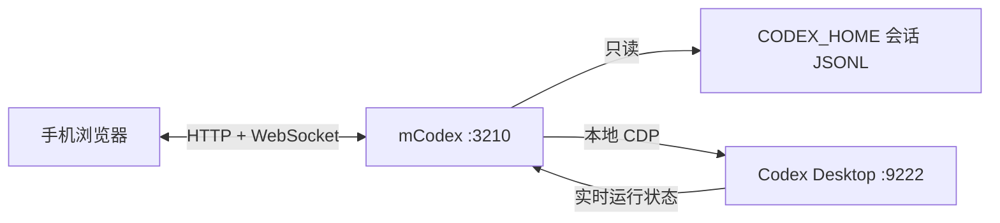

# mCodex

在手机浏览器里查看和操作 Windows 上的 Codex Desktop。

[English](README.en.md) · [参与贡献](CONTRIBUTING.md) · [安全说明](SECURITY.md)

这是一个非官方项目，与 OpenAI 无关。mCodex 在本机运行，读取 `CODEX_HOME` 中的会话记录，并通过 CDP 操作 Codex Desktop。它不会修改会话文件。

## 功能

- 在手机浏览器中按项目查看 Codex 对话和实时进度
- 查看 Desktop 正在生成的回答
- 选择或粘贴图片后预览并发送，历史消息中的图片也可直接查看
- 打开任务、发送消息、停止任务，并处理审批请求
- 查看和切换 Codex Desktop 的权限模式
- 查看结构化文件修改卡片、文件路径及增删行数
- 创建项目和新建任务
- 通过局域网从手机或另一台电脑访问

## 工作方式



mCodex 从会话 JSONL 中读取对话和任务记录，从 Desktop CDP 获取运行状态。发送消息、停止任务、处理审批和创建任务都由 Codex Desktop 执行。

## 环境要求

| 项目 | 要求 |
| --- | --- |
| 操作系统 | Windows 10/11（当前启动脚本使用 PowerShell 和 Microsoft Store 包） |
| Codex Desktop | 已安装并登录的 Windows Store 版 Codex Desktop（包名 `OpenAI.Codex`） |
| Node.js | `20.19+` 或 `22.12+`，并自带 npm；Vite 7 不支持旧版本 |
| 浏览器 | 手机或桌面上的现代浏览器，WebSocket 必须可用 |
| 网络端口 | Bridge 默认 `3210`；Codex CDP 默认 `9222`，只允许本机访问 |
| 可选 | Git（从仓库获取源码） |

> 首次启动前请完全退出普通模式的 Codex Desktop。Bridge 会用 `--remote-debugging-port=9222` 重新启动它；如果 Desktop 已在运行但没有 CDP，控制功能会不可用。

## 快速开始

### 使用管理脚本

在项目根目录双击 `manage.bat`，或在命令提示符中运行：

```bat
manage.bat start
```

脚本会按顺序执行以下操作：

1. 检查 `winget`；缺少时打开 Microsoft App Installer 安装页
2. 检查兼容版本的 Node.js/npm；缺少时通过 `winget` 安装 Node.js LTS
3. 检查 Codex Desktop 是否已安装；缺少时停止并提示
4. 执行 `npm ci`，构建服务端和生产前端
5. 以本地 CDP 模式启动 Codex Desktop
6. 在 `0.0.0.0:3210` 启动 Bridge 并打开本地页面 `http://127.0.0.1:3210/`

首次安装 Node.js 时，Windows 可能弹出安装确认或 UAC 窗口；按提示完成后重新运行脚本。Codex Desktop 必须预先安装并登录。

### 发布包

项目同时提供三种 Windows 发行形态：

```powershell
npm run release:source    # 源码 ZIP，适合开发者
npm run release:portable  # 便携 ZIP，内置 Node.js，无需 npm install
npm run release:sea       # Node SEA 单文件 EXE
npm run release            # 一次生成以上三种发行物
```

发行物会写入 `release/`（该目录默认不提交到 Git）：

- `*-source.zip` 保留源码、测试和 `manage.bat`；使用者需要自行安装 Node.js。
- `*-portable.zip` 内置 Node.js、预构建服务端和 Web 文件，解压后运行 `start.bat` 即可。
- `*.exe` 使用 Node 22 SEA，把服务端、Web 静态资源和 CDP 启动脚本嵌入单个 EXE；首次运行仍要求本机已安装 Codex Desktop。

SEA EXE 当前未做代码签名，Windows SmartScreen 可能显示未知发布者提示。正式对外分发时建议为 EXE 或安装包配置代码签名证书。CDP 启动使用独立的 `RemoteBridgeProfile` 配置目录，首次启动可能需要在 Codex Desktop 中重新登录。

启动完成后会自动打开电脑端页面。页面会显示局域网连接二维码和中文提示；手机与电脑连接同一 Wi-Fi 后，使用相机扫码即可自动配对。也可以手工打开局域网地址，例如 `http://192.168.1.20:3210/`，再输入启动窗口中的八位配对码。配对码有效 10 分钟，日志位于 `.run-logs\\bridge.out.log`。

### 手动启动

```powershell
npm ci
npm run build

# 另开一个窗口：启动带 CDP 的 Codex Desktop
powershell -ExecutionPolicy Bypass -File .\\scripts\\start-codex-cdp.ps1

# 本机只读开发/使用
npm start
```

手动启动默认只监听 `127.0.0.1:3210`，不会暴露到局域网。要开放局域网访问，请先设置强 Token：

```powershell
$env:BRIDGE_HOST = '0.0.0.0'
$env:BRIDGE_TOKEN = '请替换成至少 24 个字符的随机字符串'
npm start
```

手机首次打开页面后，输入启动日志中显示的配对码。配对成功后，Token 会保存在该浏览器的本地存储中。

## 管理命令

| 命令 | 用途 |
| --- | --- |
| `manage.bat` / `manage.bat start` | 启动 CDP、构建并启动局域网 Bridge |
| `manage.bat restart` | 重新执行一键启动 |
| `manage.bat stop` | 停止 Bridge 服务（不会退出 Codex Desktop） |
| `manage.bat status` | 查看 `3210` 和 `9222` 是否在线 |
| `manage.bat install` | 检查 Node.js 并安装 npm 依赖 |
| `manage.bat build` | 构建服务端和生产前端 |
| `manage.bat cdp` | 只启动带 CDP 的 Codex Desktop |
| `manage.bat lan` | 以 `0.0.0.0:3210` 启动 Bridge |
| `manage.bat logs` | 查看最近 Bridge 日志 |
| `manage.bat open` | 打开本机 Bridge 页面 |

## 局域网访问

一键启动已经监听 `0.0.0.0:3210`。手机和电脑连接同一个 Wi-Fi 后访问：

```text
http://<电脑局域网 IP>:3210/
```

Windows 防火墙若拦截 Node.js，请只允许家庭/专用网络访问 `3210`，不要为公网网络开放。不要转发 `9222`。

## 配置

配置通过环境变量读取。`.env.example` 只是参考文件；项目没有加载 dotenv，不会自动读取 `.env`。

| 变量 | 默认值 | 说明 |
| --- | --- | --- |
| `BRIDGE_HOST` | `127.0.0.1` | 监听地址；非 loopback 地址会强制 Token 鉴权 |
| `BRIDGE_PORT` | `3210` | Bridge HTTP/WebSocket 端口 |
| `BRIDGE_TOKEN` | 空 | 外部监听时至少 24 个字符；留空会在 `CODEX_HOME/remote-bridge-token` 持久化生成，已配对设备重启后仍可访问 |
| `BRIDGE_TOKEN_FILE` | `CODEX_HOME/remote-bridge-token` | 自动生成的设备信任令牌保存位置；删除此文件即可让所有已配对设备重新配对 |
| `CODEX_HOME` | `%USERPROFILE%\\.codex` | Codex 会话目录 |
| `CODEX_CDP_URL` | `http://localhost:9222` | 本地 Codex CDP 地址（兼容 IPv4/IPv6 回环监听） |
| `BRIDGE_SCAN_INTERVAL_MS` | `500` | 会话目录扫描间隔（毫秒） |

生成 Token 的示例：

```powershell
$bytes = New-Object byte[] 32
[Security.Cryptography.RandomNumberGenerator]::Fill($bytes)
$env:BRIDGE_TOKEN = [Convert]::ToBase64String($bytes).Replace('+', '-').Replace('/', '_').TrimEnd('=')
```

生产环境建议使用密码管理器生成并设置 `BRIDGE_TOKEN`，不要把 `.run-logs`、`remote-bridge-token` 或 Token 提交到仓库、截图或聊天中。手机首次配对后，浏览器会保存设备令牌；后续重启 Bridge 不需要再次输入配对码。若需要撤销已有设备信任，停止 Bridge 后删除 `CODEX_HOME/remote-bridge-token`，再重新启动并配对。

## 开发与测试

```powershell
npm ci
npm run dev       # Vite: http://127.0.0.1:5173，API/WebSocket 代理到 3210
npm run build     # 类型检查 + 生产前端构建
npm test -- --run # Vitest 测试
```

开发模式下，若需要发送消息、停止任务或处理审批，仍需另行执行 `manage.bat cdp`。只查看已保存会话时可以不启动 CDP。

## API 速览

所有 `/api/*`（`/api/health`、`/api/pair` 和仅限本机访问的 `/api/pairing-info` 除外）以及 `/ws` 都需要 Token。API 默认使用 `Authorization: Bearer <token>`；图片读取 `/api/media` 和 WebSocket 使用 `?token=<token>`。

| 方法 | 路径 | 用途 |
| --- | --- | --- |
| `GET` | `/api/health` | 健康检查和鉴权状态 |
| `GET` | `/api/status` | Bridge、CDP 和会话目录状态 |
| `PUT` | `/api/permissions` | 切换 Desktop 的 `ask` / `auto` / `full-access` 权限模式 |
| `GET` | `/api/threads` | 任务列表 |
| `GET` | `/api/threads/:id/timeline` | 任务时间线与审批请求 |
| `GET` | `/api/media` | 读取指定任务历史消息引用的本地图片 |
| `POST` | `/api/threads/:id/open` | 切换 Desktop 当前任务 |
| `POST` | `/api/threads/:id/send` | 发送消息 |
| `POST` | `/api/threads/:id/follow-up` | 任务运行中发送后续消息；`mode` 为 `steer` / `queue` / `interrupt` |
| `POST` | `/api/threads/:id/stop` | 停止任务 |
| `POST` | `/api/threads/:id/approval` | `approve` / `reject` 审批 |
| `GET` / `POST` | `/api/projects` | 查询或创建项目 |
| `GET` | `/api/fs/roots` | 列出电脑快捷目录和盘符 |
| `GET` | `/api/fs/list` | 列出指定目录下的子文件夹 |
| `POST` | `/api/tasks` | 创建任务 |

发送消息和创建任务都必须携带 UUID 格式的 `clientMessageId`，用于避免重复提交。发送和后续消息还可携带最多 4 张图片；每张图片不超过 10 MB，支持 AVIF、GIF、JPEG、PNG 和 WebP：

```json
{
  "clientMessageId": "3f707e82-dd85-4d23-bf36-1fbf59a863d4",
  "content": "请分析这张截图",
  "images": [
    {
      "name": "screenshot.png",
      "mimeType": "image/png",
      "data": "<Base64 数据>"
    }
  ]
}
```

## 安全边界

- `9222` 始终绑定本机回环地址，不要通过端口转发或任何网络方式暴露
- 外部监听必须设置至少 24 个字符的 `BRIDGE_TOKEN`
- 配对码只在启动日志出现一次，10 分钟后失效，连续错误 10 次会锁定到 Bridge 重启
- Bridge 读取本地会话数据；发送、停止、审批和创建操作由 Codex Desktop 执行
- 服务不包含多用户隔离、细粒度权限或审计系统，不适合作为公网 SaaS 直接部署

## 已知限制

- Codex Desktop 更新后，CDP 页面控件或 selector 变化可能导致控制功能失效
- 电脑睡眠或 Desktop 完全退出后，只能看到最后一次已保存的会话状态
- 创建项目可在网页内浏览电脑目录并选择文件夹；也可继续手动输入绝对路径
- 当前启动脚本面向 Microsoft Store 版 Codex Desktop；其它安装渠道可能需要自行调整 `scripts/start-codex-cdp.ps1`
- 项目当前只保证局域网内访问，不包含公网穿透、账号体系或多用户隔离

## 故障排查

| 现象 | 处理 |
| --- | --- |
| `Node.js not found` | 安装 Node.js `20.19+` 或 `22.12+`，重新打开终端 |
| `Codex control: OFFLINE` | 完全退出 Codex，运行 `manage.bat cdp`，再用 `manage.bat status` 检查 `9222`；新版 Desktop 可能只监听 `::1`，请使用 `localhost` 而非固定的 `127.0.0.1` |
| 手机无法打开页面 | 确认电脑和手机在同一网络，检查 Windows 防火墙及 `3210` 端口 |
| 配对码失效 | 配对码 10 分钟过期或尝试次数用尽，重启 Bridge 获取新码 |
| 页面能看但不能操作 | CDP 未上线；读取会话和桌面控制是两个独立能力 |
| Bridge 启动失败 | 运行 `manage.bat logs`，检查 `.run-logs\\bridge.err.log` |

## 项目结构

```text
src/
  server.ts                 HTTP API、鉴权、WebSocket
  cdp/controller.ts         Codex Desktop CDP 控制
  sessions/store.ts         会话读取
  sessions/watcher.ts       会话变化监听
  sessions/parser.ts        事件到时间线的解析
  runtime-status.ts         Desktop 运行状态合并
web/src/
  main.tsx                  React 页面和交互
  styles.css                移动端优先样式
scripts/                    Codex CDP 和环境启动脚本
scripts/manage.ps1          新电脑环境检测、安装和启动流程
manage.bat                  Windows 管理入口
```

## 参与贡献

欢迎提交 Issue 和 Pull Request。涉及 CDP selector、鉴权、会话解析或远程访问的改动，请同时补充测试或复现步骤，并在提交前运行：

```powershell
npm run build
npm test -- --run
```

## 许可证

本项目采用 [MIT License](LICENSE)。
